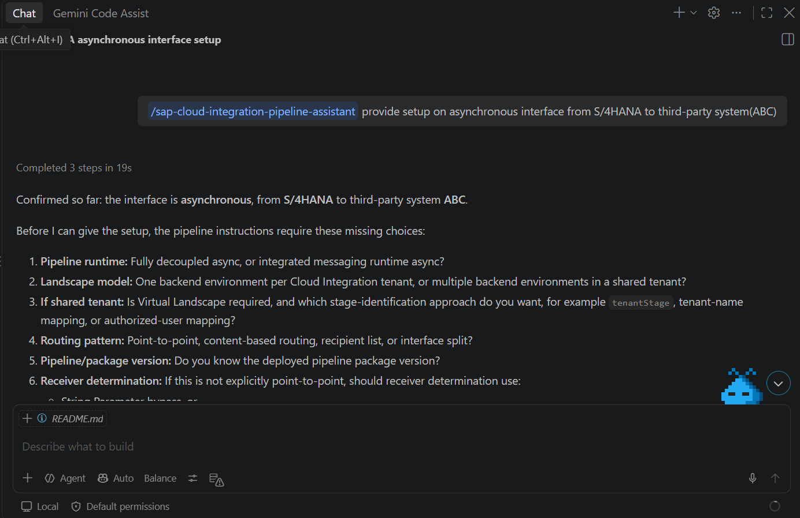
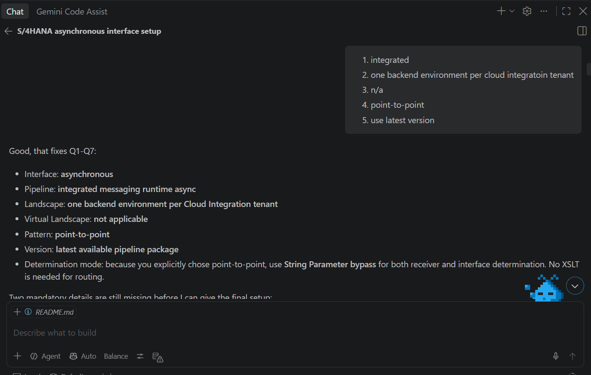
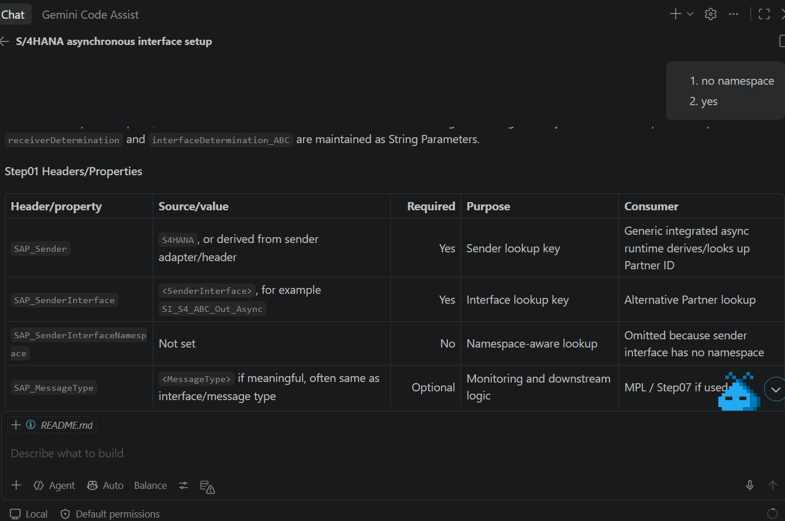
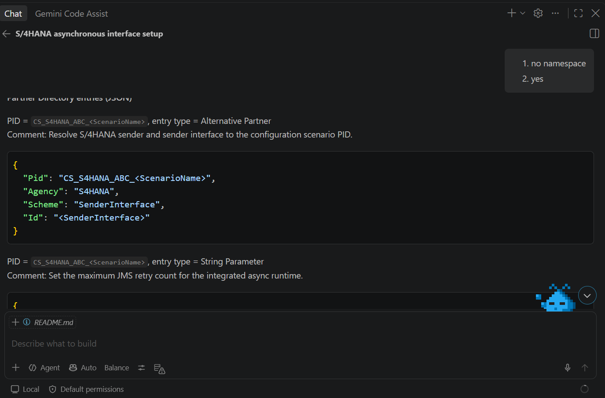

# SAP Cloud Integration Pipeline Assistant

GitHub Copilot Agent Skill for SAP Integration Suite Cloud Integration Pipeline framework assistance.

## Install in a repository
Copy the included `.github/skills/sap-cloud-integration-pipeline-assistant` folder into the root of your Git repository, commit it, then use GitHub Copilot Agent mode.

For Claude - `.claude/skills/sap-cloud-integration-pipeline-assistant`

## Personal installation
Copy the skill folder to `~/.copilot/skills/sap-cloud-integration-pipeline-assistant`.

For Claude = `~/.claude/skills/sap-cloud-integration-pipeline-assistant`.

## Scope
The skill provides implementation assistance, Partner Directory guidance, XSLT/Groovy examples, architecture decisions, and troubleshooting. It does not generate or deploy complete iFlow artifacts.

## Source files
The `references` folder contains curated knowledge and links that `SKILL.md` loads on demand. External sources remain subject to their own terms.

## Example
 
 
 
 

## Authors
* **Ching Hong, Chong**